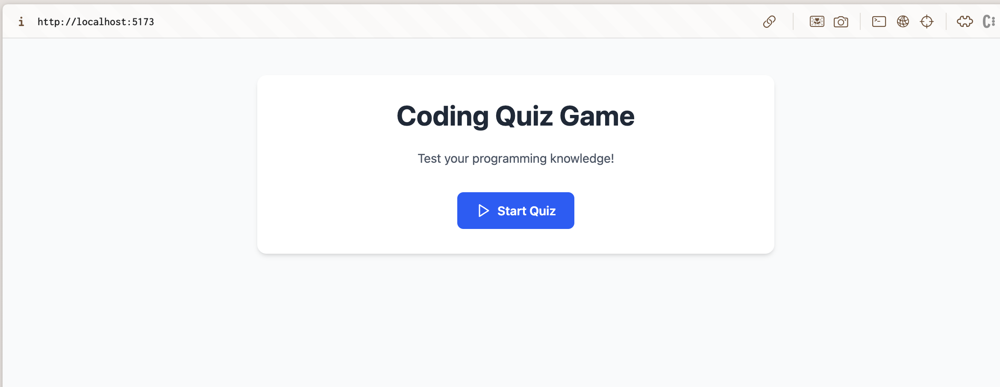
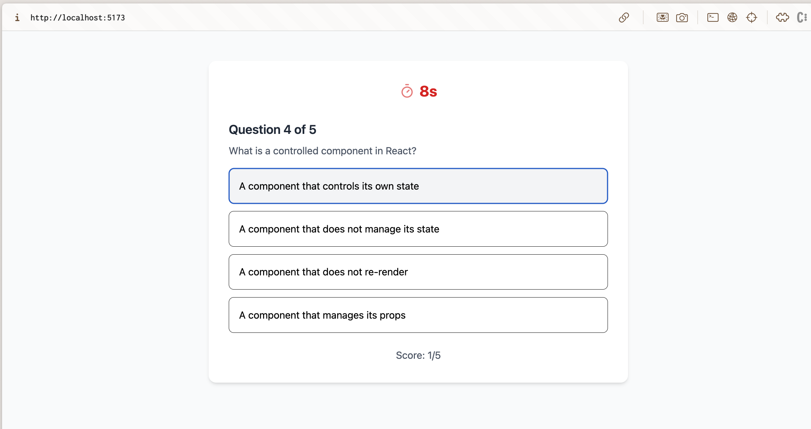
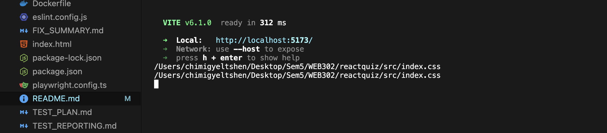
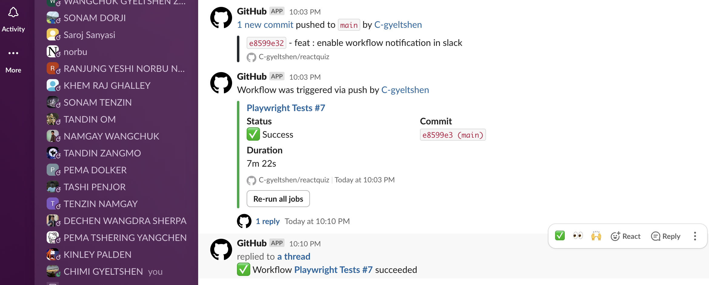
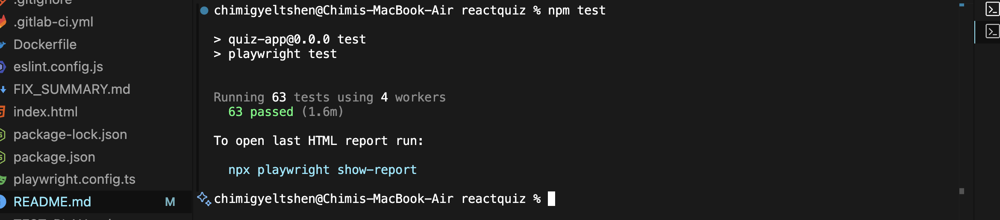

# Kahoot Clone – React Quiz App

> **A modern, interactive quiz application inspired by Kahoot, built with React, TypeScript, Vite, Tailwind CSS, and Playwright.**

---

## Table of Contents

- [Project Overview](#project-overview)
- [Features](#features)
- [Screenshots](#screenshots)
- [Architecture](#architecture)
- [Getting Started](#getting-started)
- [Testing](#testing)
- [Docker Usage](#docker-usage)
- [Functional Test Cases](#functional-test-cases)
- [Contributing](#contributing)
- [License](#license)

---

## Project Overview

This project is a capstone for SWE5006 (DMSS, NUS) and demonstrates modern software design and testing practices. It is a single-page web app that lets users take a timed quiz, get instant feedback, and see their score at the end. The app is inspired by Kahoot but is fully self-contained and open source.

---

## Features

- **Modern UI**: Responsive, mobile-friendly, and visually appealing interface using Tailwind CSS and Lucide icons.
- **Quiz Flow**: Start, play, and complete a quiz with instant feedback on each answer.
- **Timer**: 30-second countdown per quiz session, with visual warning when time is low.
- **Score Tracking**: Real-time score updates and final score summary.
- **Game State Management**: Start, playing, and game-over states with smooth transitions.
- **Edge Case Handling**: Prevents rapid/multiple clicks, handles browser refresh, and resets state as expected.
- **Comprehensive Testing**: End-to-end tests with Playwright, including UI, UX, and edge cases.
- **Data Validation**: Ensures question data integrity and correct scoring.

---

## Screenshots




---

## Architecture

- **Frontend**: React + TypeScript (Vite)
- **Styling**: Tailwind CSS, Lucide React icons
- **Testing**: Playwright for E2E, ESLint for linting
- **Project Structure:**
  - `src/` – Main source code (components, data, types)
  - `test/` and `tests/` – Playwright test suites
  - `public/` – Static assets
  - `scripts/` – Test report generation
  - `Dockerfile` – Containerization support

---

## Getting Started

### Prerequisites

- [Node.js](https://nodejs.org/) (v18 or newer recommended)
- [npm](https://www.npmjs.com/) (comes with Node.js)

### Installation & Local Development

1. **Install dependencies:**
   ```bash
   npm install
   ```
2. **Start the development server:**
   ```bash
   npm run dev
   ```
   The app will be available at [http://localhost:5173](http://localhost:5173).
3. **Build for production:**
   ```bash
   npm run build
   ```
4. **Preview the production build:**
   ```bash
   npm run preview
   ```
5. **Lint the codebase:**
   ```bash
   npm run lint
   ```

---

## Testing

This project uses [Playwright](https://playwright.dev/) for end-to-end testing. Tests cover quiz flow, timer, game state, UI/UX, edge cases, and data validation.

### Running Tests

1. **Start the development server:**
   ```bash
   npm run dev
   ```
   
2. **Run all tests (in a separate terminal):**
   ```bash
   npm run test
   ```
3. **Run tests with UI mode:**
   ```bash
   npm run test:ui
   ```
4. **Run tests in debug mode:**
   ```bash
   npm run test:debug
   ```
5. **View test reports:**
   ```bash
   npm run test:report
   ```
6. **Generate a markdown test report:**
   ```bash
   npm run test:md-report
   ```

#### Test Coverage

- Quiz flow, timer, game state, UI/UX, edge cases, and data validation are all covered.
- See [TEST_PLAN.md](./TEST_PLAN.md) and [TEST_SUMMARY.md](./TEST_SUMMARY.md) for details.

---

## Docker Usage

You can run the app in a Docker container:

1. **Build the Docker image:**
   ```bash
   docker build -t quiz-app .
   ```
2. **Run the container:**
   ```bash
   docker run -p 3000:3000 quiz-app
   ```
   The app will be available at [http://localhost:3000](http://localhost:3000).

---

## GitHub & Slack Integration

This project is integrated with Slack to receive real-time notifications for both new commits and GitHub Actions workflows (such as Playwright test runs). This ensures the team is always up-to-date on code changes and CI/CD status.

### How it works

- **Commit Notifications:** Every new commit pushed to the repository triggers a Slack message in the designated channel, showing the commit message, author, and a link to the commit.
- **Workflow Notifications:** When a GitHub Actions workflow (e.g., Playwright tests) runs, Slack receives a notification about the workflow status (success/failure) with details and links.

#### Example Slack Notifications

<!-- Replace the image filenames below with your actual screenshot filenames after uploading them to the public/ directory -->



---

## Functional Test Cases

The following test cases are implemented and validated by automated tests:

### 1. Quiz Flow Tests

- **Start Quiz**: Quiz starts from the initial screen, timer initializes to 30 seconds, and the first question is displayed.
- **Answer Selection**: Selecting an answer highlights it, provides feedback, and auto-advances after 1.5 seconds.
- **Correct Answer Scoring**: Selecting the correct answer increases the score and shows positive feedback.
- **Incorrect Answer Handling**: Selecting an incorrect answer does not increase the score, highlights the correct answer, and shows negative feedback.
- **Complete Quiz**: Quiz ends after the last question, and the final score is displayed.

### 2. Timer Tests

- **Timer Countdown**: Timer counts down from 30 to 0 in 1-second intervals during the quiz.
- **Timer Expiry**: Quiz ends automatically when the timer reaches 0, and the final score is shown.
- **Timer Visual Feedback**: Visual warning (e.g., color change) when timer is low (≤10 seconds).

### 3. Game State Tests

- **Restart Quiz**: Clicking the restart button resets the quiz to the start state, with score and question index reset.
- **Question Navigation**: Question counter advances correctly and new questions are displayed as answers are selected.

### 4. UI/UX Tests

- **Responsive Design**: Layout adapts properly to different screen sizes.
- **Visual Feedback**: Selected answers and feedback (correct/incorrect) are visually distinct.

### 5. Edge Case Tests

- **Rapid Answer Selection**: Only the first answer is registered if multiple options are clicked quickly.
- **Multiple Start Clicks**: Rapid clicking of the start button does not start multiple games or timers.
- **Browser Refresh**: Refreshing the browser during a quiz resets the game to the start state (no persistence).

### 6. Data Validation Tests

- **Question Data Integrity**: All questions have 4 options and valid correct answer indices.
- **Score Calculation**: Final score matches the number of correct answers selected.
- **Timer Data Validation**: Timer starts at 30, is numeric, and decrements by 1 each second.

---

## Contributing

Contributions are welcome! Please open issues or pull requests for bug fixes, improvements, or new features. For major changes, discuss them in an issue first.

---

## Setup Instructions

### Prerequisites

- [Node.js](https://nodejs.org/) (v18 or newer recommended)
- [npm](https://www.npmjs.com/) (comes with Node.js)

### Installation

1. **Install dependencies:**

```bash
npm install
```

2. **Start the development server:**

```bash
npm run dev
```

The app will be available at [http://localhost:5173](http://localhost:5173) by default.

3. **Build for production:**

```bash
npm run build
```

4. **Preview the production build:**

```bash
npm run preview
```

5. **Lint the codebase:**

```bash
npm run lint
```

## Testing

This project includes comprehensive end-to-end tests using Playwright.

### Running Tests

1. **Start the development server:**

```bash
npm run dev
```

2. **Run all tests (in a separate terminal):**

```bash
npm run test
```



3. **Run tests with UI mode:**

```bash
npm run test:ui
```

4. **Run tests in debug mode:**

```bash
npm run test:debug
```

5. **View test reports:**

```bash
npm run test:report
```

### Test Coverage

The test suite covers all functional requirements outlined below:

- **Quiz Flow Tests**: Start quiz, answer selection, scoring, completion
- **Timer Tests**: Countdown functionality and expiry behavior
- **Game State Tests**: Restart functionality and question navigation
- **UI/UX Tests**: Responsive design and visual feedback
- **Edge Cases**: Rapid clicking and browser refresh scenarios
- **Data Validation**: Question integrity and score calculation

### Docker Setup (Alternative)

If you prefer to use Docker, you can run the application in a container:

1. **Build the Docker image:**

```bash
docker build -t quiz-app .
```

2. **Run the container:**

```bash
docker run -p 3000:3000 quiz-app
```

The app will be available at [http://localhost:3000](http://localhost:3000).

---

This project uses React, TypeScript, Vite, Tailwind CSS, and Lucide icons. For more details, see the source code and configuration files.

## Functional Test Cases

The following test cases can be used to validate the application functionality:

### 1. Quiz Flow Tests

**TC001: Start Quiz**

- **Precondition**: Application is loaded
- **Steps**: Click "Start Quiz" button
- **Expected**: Game transitions to playing state, first question appears, timer starts at 30 seconds

**TC002: Answer Selection**

- **Precondition**: Quiz is in playing state
- **Steps**: Click on any answer option
- **Expected**: Answer is highlighted, feedback is shown, auto-advances to next question after 1.5 seconds

**TC003: Correct Answer Scoring**

- **Precondition**: Quiz is playing, current question has correct answer at index 0
- **Steps**: Click the correct answer option
- **Expected**: Score increases by 1, positive feedback shown

**TC004: Incorrect Answer Handling**

- **Precondition**: Quiz is playing
- **Steps**: Click an incorrect answer option
- **Expected**: Score remains unchanged, correct answer highlighted, negative feedback shown

**TC005: Complete Quiz**

- **Precondition**: On the last question
- **Steps**: Answer the final question
- **Expected**: Game transitions to end state, final score displayed

### 2. Timer Tests

**TC006: Timer Countdown**

- **Precondition**: Quiz is playing
- **Steps**: Wait and observe timer
- **Expected**: Timer counts down from 30 to 0 in 1-second intervals

**TC007: Timer Expiry**

- **Precondition**: Quiz is playing, timer reaches 0
- **Steps**: Let timer reach 0 without answering
- **Expected**: Quiz ends automatically, final score shown

### 3. Game State Tests

**TC008: Restart Quiz**

- **Precondition**: Quiz has ended (game over screen visible)
- **Steps**: Click "Play Again" or restart button
- **Expected**: Quiz resets to start state, score resets to 0, question index resets to 0

**TC009: Question Navigation**

- **Precondition**: Quiz is playing
- **Steps**: Answer multiple questions in sequence
- **Expected**: Question counter advances correctly, new questions appear

### 4. UI/UX Tests

**TC010: Responsive Design**

- **Precondition**: Application loaded
- **Steps**: Resize browser window or test on different devices
- **Expected**: Layout adapts properly to different screen sizes

**TC011: Visual Feedback**

- **Precondition**: Quiz is playing
- **Steps**: Select answers and observe visual changes
- **Expected**: Selected answers show visual feedback, correct/incorrect states clearly indicated

### 5. Edge Cases

**TC012: Rapid Answer Selection**

- **Precondition**: Quiz is playing
- **Steps**: Quickly click multiple answer options before auto-advance
- **Expected**: Only first selection is registered, prevents multiple selections

**TC013: Browser Refresh**

- **Precondition**: Quiz is in progress
- **Steps**: Refresh the browser
- **Expected**: Quiz resets to start state (no persistence expected)

### 6. Data Validation Tests

**TC014: Question Data Integrity**

- **Precondition**: Application loaded
- **Steps**: Navigate through all questions
- **Expected**: All questions have 4 options, correct answer indices are valid (0-3)

**TC015: Score Calculation**

- **Precondition**: Complete quiz with known correct/incorrect answers
- **Steps**: Answer specific pattern of questions
- **Expected**: Final score matches expected calculation (correct answers / total questions)
